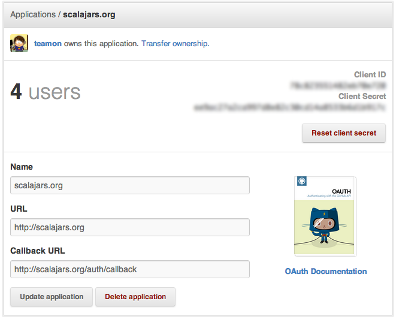
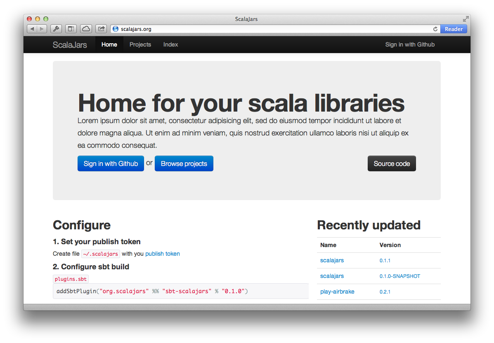

# Wdrożenie #

Aplikacja działa na Maszynie Wirtualnej Javy, więc jest teoretyczna możliwość uruchomienia jej na każdym systemie. Jednak autorzy bazy danych Redis oficjalnie wspierają tylko środowiska kompatybilne ze standardem POSIX. Z tego względu opisany sposób instalacji będzie oparty na tym właśnie standardzie. 

Standardową metodą uruchamiania aplikacji opartych o framework Play! jest użycie tzw. reverse proxy - użycie serwera HTTP (np. nginx, apache) który działa na porcie 80 i przekazuje połączenia do serwera aplikacji który działa na porcie z zakresu 1024-65535. Istnieje również możliwość uruchomienia aplikacji bezpośrednio na porcie 80 jednak wymaga to uruchomienia procesu aplikacji z prawami roota co w razie błędów w aplikacji może narazić serwer na uszkodzenie.

Opisany sposób instalacji dotyczy systemu Ubuntu 12.04 LTS x86_64 oraz serwera HTTP nginx.

## Konfiguracja środowiska ##

Wymagania systemowe:

  * POSIX
  * JRE + JDK (wersja 6 lub wyższa)
  * nginx
  * redis
  * git
  * sbt

W przypadku systemu Ubuntu powyższe aplikacji można zainstalować za pomocą menadżera pakietów `apt-get`.

### Konfiguracja serwera nginx ###

Plik `/etc/nginx/nginx.conf`

```conf
user www-data;
worker_processes 4;
pid /var/run/nginx.pid;

events {
        worker_connections 768;
}

http {
        server_names_hash_bucket_size 64;
      
        # Basic Settings
        sendfile on;
        tcp_nopush on;
        tcp_nodelay on;
        keepalive_timeout 65;
        types_hash_max_size 2048;

        client_max_body_size 256M;          

        include /etc/nginx/mime.types;
        default_type application/octet-stream;

        access_log /var/log/nginx/access.log;
        error_log /var/log/nginx/error.log;

        server {
          listen 80;

          server_name  *.scalajars.org scalajars.org;

          root        /home/scalajars/public;
          index       index.html index.htm;

          location / {
            proxy_set_header  X-Real-IP  $remote_addr;
            proxy_set_header  X-Forwarded-For $proxy_add_x_forwarded_for;
            proxy_set_header  Host $http_host;
            proxy_redirect  off;

            if (-f $request_filename/index.html) {
              rewrite (.*) $1/index.html break;
            }

            if (-f $request_filename.html) {
              rewrite (.*) $1.html break;
            }
            
            if (!-f $request_filename) {
              proxy_pass http://localhost:60001;
              break;
            }

          }

          error_page   500 502 503 504  /50x.html;
          location = /50x.html {
            root   html;
          }
        }
    }
}
```

Ważne elementy powyższej konfiguracji:

* `client_max_body_size 256M;` - zwiększenie standardowego limitu na rozmiar pliku przesyłanego na serwer
* `server_name  *.scalajars.org scalajars.org;` - definicja domen które mają być przekierowane do aplikacji
* `proxy_pass http://localhost:60001;` - definicja portu na którym działa aplikacja


## Konfiguracja aplikacji ##

### Konfiguracja GitHub OAuth ###

Aby umożliwić użytkownikom logowanie do aplikacji ScalaJars kontem z serwisu GitHub należy w ustawieniach własnego konta w serwisie utworzyć nową aplikację OAuth w zakładce `Account Settings/Applications`. Przykład konfiguracji znajduje się na Rysunku \ref{fig-github}. Po utworzeniu aplikacji OAuth należy skopiować wygenerowane `Client ID` oraz `Client Secret`, które będą potrzebne w kolejnym kroku konfiguracji.




### Pobranie kodu aplikacji ###

Kod źródłowy aplikacji ScalaJars jest przechowywany za pomocą systemu kontroli wersji Git, opublikowany w serwisie GitHub w repozytorium publicznym `teamon/scalajars.org`^[[https://github.com/teamon/scalajars.org](https://github.com/teamon/scalajars.org)]. Pobranie aplikacji sprowadza się do wykonania komendy:

```bash
$ git clone git@github.com:teamon/scalajars.org.git
```

Serwis GitHub umożliwia także pobranie archiwum z ostatnią wersją projektu z adresu `https://github.com/teamon/scalajars.org/archive/master.tar.gz`.


### Konfiguracja parametrów aplikacji ###

Konfiguracja aplikacji znajduje się w pliku `conf/application.conf`. Jest to plik w formacie HOCON^[HOCON - [https://github.com/typesafehub/config](https://github.com/typesafehub/config)].
W repozytorium plik ten jest jest przygotowany tak, aby pobierał parametry ze zmiennych środowiskowych, jednak można wpisać ustawienia bezpośrednio do pliku. 

Ważne parametry aplikacji:

Klucz                         Opis
-------------------           --------------
`upload.dir`                  Katalog, w którym przechowywane będą opublikowane artefakty
`oauth.github.clientId`       `Client ID` pobrane z serwisu GitHub
`oauth.github.clientSecret`   `Client Secret` pobranie z serwisu GitHub
`redis.host`                  Host bazy danych Redis
`redis.port`                  Port bazy danych Redis

### Uruchomienie aplikacji ###

Po wykonaniu powyższych kroków należy skompilować kod aplikacji do wykonywalnego archiwum JAR za pomocą komendy

```bash
$ sbt stage
```

Utworzy to katalog `target/staged` zawierający skompilowaną aplikację oraz wszystkie zależności, a także plik `target/start` służący do uruchomienia aplikacji. 

Ostatnim parametrem który należy podać jest port na którym będzie nasłuchiwał serwer aplikacji - w tym przypadku jest to port 60001. 

```bash
$ target/start -Dhttp.port=60001
```

Po wykonaniu powyższej komendy aplikacja zostanie uruchomiona i będzie dostępna pod adresem `http://scalajars.org`.



